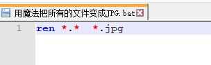

#### 林哥教你用批处理提取修改文件名

- ##### 啥子是批处理嘞

  - ​	批处理文件，在DOS和Windows（任意）系统中，**.bat文件是可执行文件，由一系列命令构成，其中可以包含对其他程序的调用**。**这个文件的每一行都是一条DOS命令**（大部分时候就好像我们在DOS提示符下执行的命令行一样），你可以使用DOS下的Edit或者**Windows的记事本(notepad)等**任何文本文件编辑工具创建和修改批处理文件。
    ​	批处理(Batch)，也称为批处理脚本。顾名思义，**批处理就是对某对象进行批量的处理**，通常被认为是一种简化的脚本语言，它应用于DOS和Windows系统中。批处理文件的扩展名为bat 或cmd。
  - 简单来说鸭，就是由系统提供的一系列的命令组成是可执行文件，**像修改文件名称这种操作**，**对于我们系统来说是可方便的**，接下来我们就来简单介绍介绍这些命令和使用的方法吧！

- ##### 实战一！简单粗暴的方法，直接把文件夹里所有的文件修改成统一格式！

  - 一行代码：

    ```
    ren （我是空格）*.* （我是空格） *.jpg
    ```

  - 代码解析：

    - ren重命名指令
    - “ * ”通配符，表示匹配任何字符
    - “ * .*”就是匹配任何格式的任何名称的文件
    - “ * .jpg”就是最后修改为以 " .jpg "为后缀名称的文件。

  - 操作过程

    - 新建一个txt，把那一行代码写入

    - 然后将txt文件的后缀名称改为**“.bat”**，然后双击运行完成修改。

      

  - 总结

    - 这种方法简单粗暴又有效，但是他**会将文件夹中所有的文件都修改成指定的格式**~需要注意噢!

- ##### 实战二！提取文件名字到Excel表格中，并且通过Excel表格进行修改！

  - 这个操作在需要整理提取文件中的内容时可以用到，但是有一丢丢复杂

    - 第一步！生成EXCEL

      - 新建一个txt文档本，然后在里头写入下面这行东西。这行代码啥子意思类，就是把当前目录的文件名称写入名字叫做test.xls文件里。

        ```dos
        dir /b>test.xls
        ```

        

      - 然后出去把这个txt文件重命名为XXX.bat文件然后双击运行，然后神奇的事情就发生了！生成了一个包含当前目录所有文件的EXCEL文件

        

    - 第二步，通过EXCEL文件操作完成自定义重命名

      - 打开我们刚刚生成的EXCEL文件，整理一下，可以把没用的信息删掉。

        

      - 使用批处理的命令**ren**，原文件名和现文件名都要**双引号**。怎么加双引号呢？？？小技巧！使用关于文件名加双引号，可通过excel中的“&”等命令实现。

        - &就是加啦，选定一行左边加上双引号右边加上双引号，就大功告成了！

        - 使用类似这样格式的命令   =C1&B1&C1 （EXCEL公式：什么意思呢？就是先选定D列，然后第D列选定位置的内容会等于C1、B1、C1三列的和，然后向下拖批量复制命令就行了）

          

        - 然后同样的操作生成ren命令列

          

        - 在当前文件夹中新建一个文本文件（**txt**），打开将刚刚生成的**ren命令**复制黏贴到里面，并且保存，将文件名改为**XXXX.bat**,双击这个文件，文件名就修改成功了。

          

  - 总结

    - 这种方法比较灵活，操作空间更大一些，但是需要一定的EXCEL基础，如果EXCEL比较熟悉，比较能随心所欲。

      